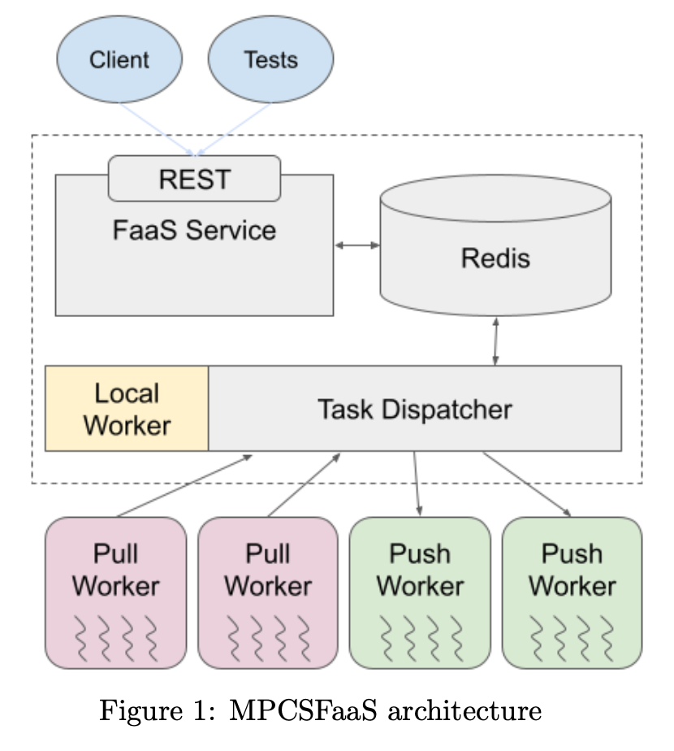

# Function as a Service (FaaS) Final Project

## Overview
MPCSFaaS is a Function-as-a-Service (FaaS) platform enabling users to execute Python functions in a serverless environment. It provides a RESTful API, a task dispatcher, and worker pools integrated with a Redis database. The system operates in three modes—`local`, `pull`, and `push`—each facilitating task assignment differently. 

The main components of MPCSFaaS are:
- **FastAPI-based RESTful API**: For managing function registration, execution, and status tracking.
- **Redis Database**: For storing registered functions, tasks, and states.
- **Task Dispatcher**: Orchestrates task distribution and manages worker states.
- **Workers**: Execute tasks and return results.
- **Message Channels**: Facilitate task communication between components.


<div align="center">
  
</div>

## Setup and run (Linux/macOS only)
__Note to grader__: 
Our python files run as packages, which was a necessary trade-off to get the `coverage` tool to work for auto-generating test reports. This means that each python component needs to be ran with `python3 -m app.<python_name>`, rather than the requested `python3 <script.py>` instructions (Ie __add__ flag `-m` and __do not__ include `.py` ending). Additionally, we opted to use a `-mode` flag in place of the requested `-m` when launching the task dispatcher to avoid confusion. Sorry for the inconvenience.

__Launch project__: 

(all commands from root project dir unless `cd` specified)
* run ```./setup_FaaS_venv``` to setup a virtual environment, activate it, and install packages
* run ```fastapi dev app/main.py``` to deploy the MPCSFaaS API server
* launch the task dispatcher with ```python3 -m app.task_dispatcher -mode [local/pull/push] -p <port> -w <num_worker_processors>```
* split terminals, ```cd app``` and launch a Redis server as a background job with ```redis-server &```. It can later be shutdown with ```redis-cli shutdown```
* If you specified pull or push worker modes, bring new workers online with ```python3 -m app.[pull_worker/push_worker] <num_worker_processors> <dispatcher url>``` 
- start push worker command example = `python3 -m app.push_worker 2 tcp://localhost:5555`
- start pull worker command example = `python3 -m app.pull_worker 2 tcp://localhost:5555`

# Github Branch Protocol
* Create a new feature with: ```git checkout -b <new-feature_branch>```
* set the upstream of your new branch to **main** with: ```git branch --set-upstream-to=origin/main```
* Push the new branch up to the remote repo:  ```git push -u origin <new-feature_branch>```
* Once the feature is finished, use ```git push``` and then create a PR on Github

# Virtual Environment Protocol 
* Locally create a venv by running ```python -m venv FaaS```. Be sure to name it ```FaaS``` to ensure that it doesn't get pushed up to the remote repo
* Activate the new venv with ```source FaaS/bin/activate``` 
* Install required packages with ```pip install -r requirements.txt```
* Make sure to keep this list up to date. If any branch feature needed new packages, run ```pip freeze > requirements.txt``` before pushing the branch to a PR
