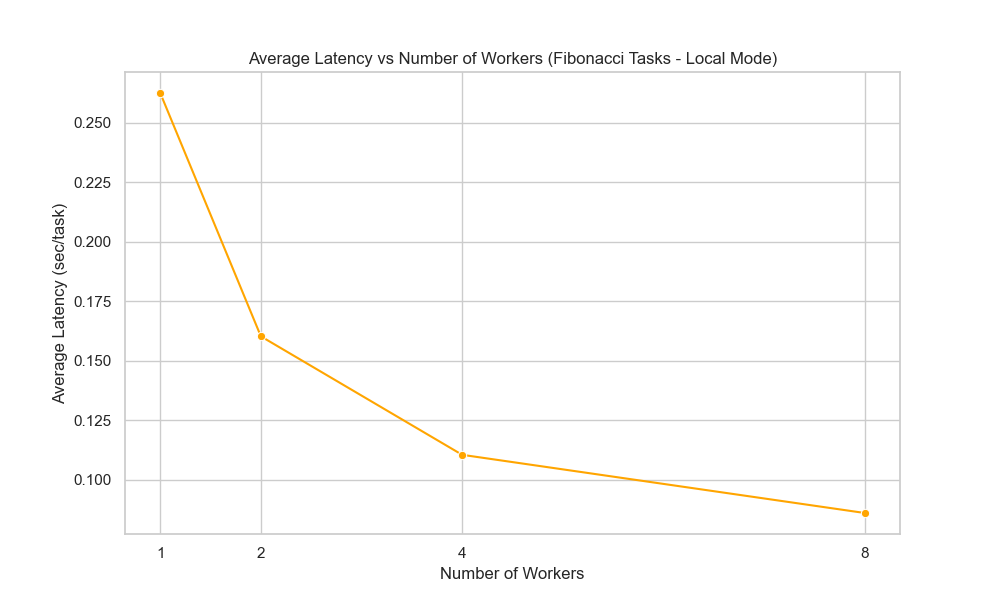
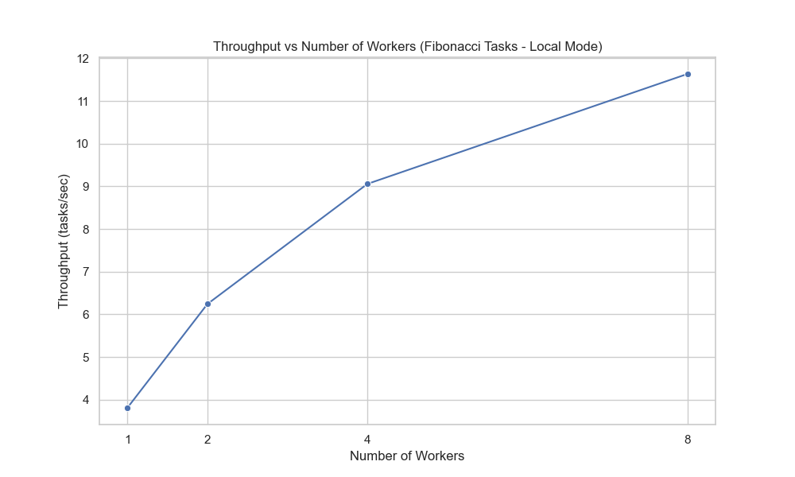
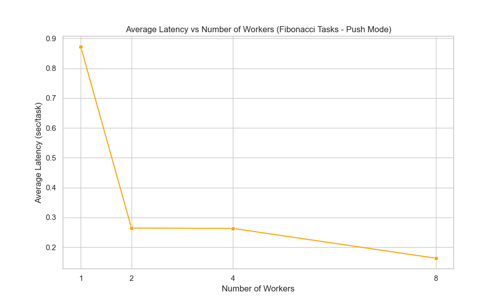
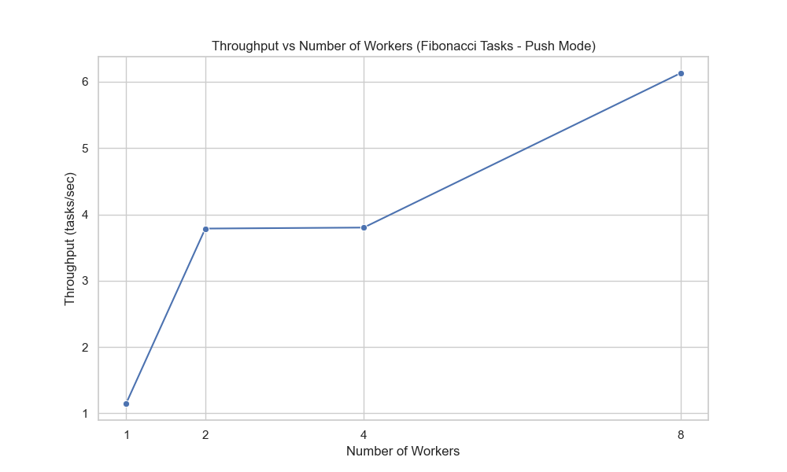
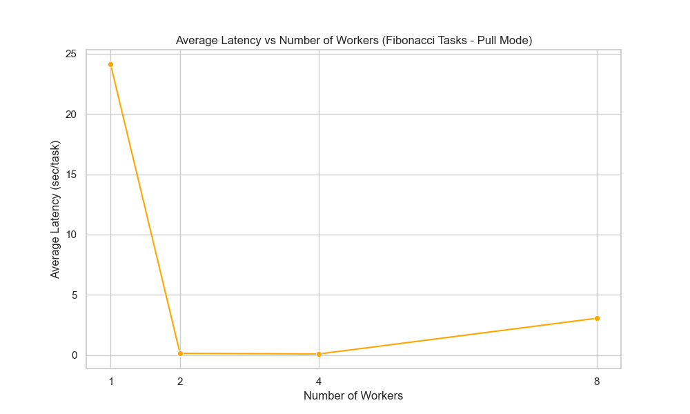
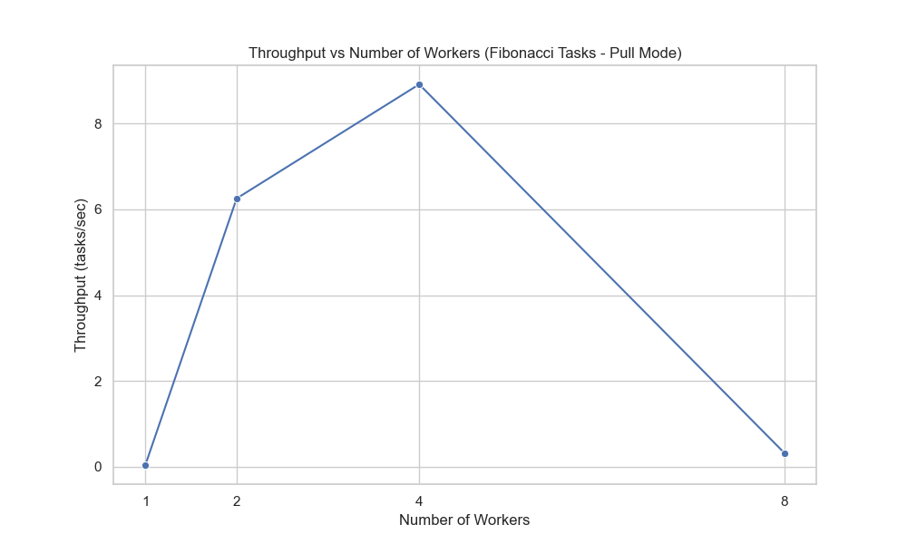
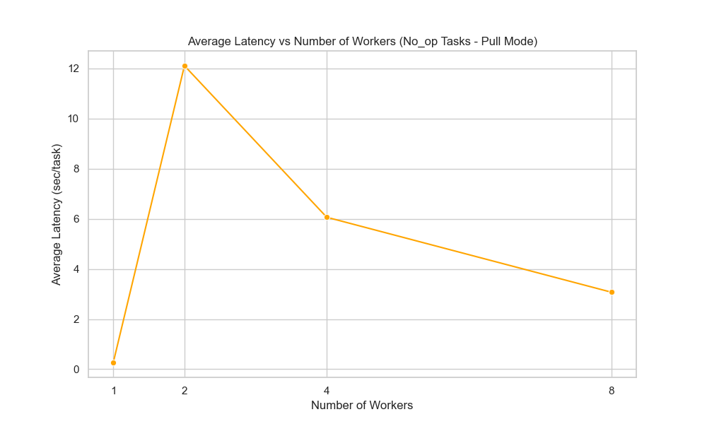
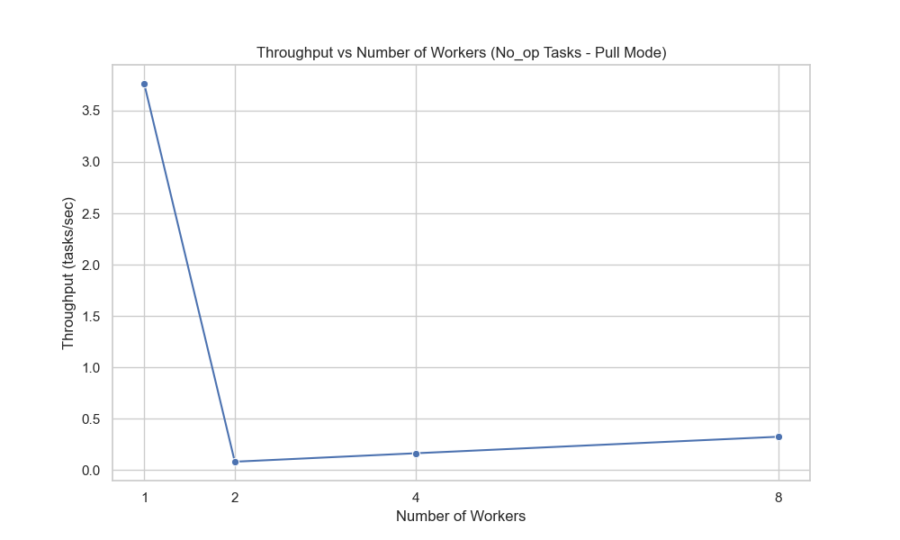

# Performance Study

We used a **weak scaling approach** to evaluate the performance of the three distinct dispatcher modes: **push**, **pull**, and **local**. The scaling study systematically increased the number of tasks through a sequence of 5, 10, 20, and 40 while maintaining a consistent task-to-worker ratio of five tasks per worker for logical worker proxy values of 1, 2, 4, and 8 respectively. Two types of tasks were employed to simulate varying computational demands: **no-op** tasks, which execute instantaneously and serve as a baseline for minimal processing overhead, and **fibonacci** tasks, which involve recursive calculations to emulate more CPU-intensive operations with the argument set to 3 due to time constraints. For each combination of dispatcher mode and task type, the script registered the corresponding function with the FastAPI backend, executed the tasks, and polled for their completion. Our selected performance metrics were **throughput** and **average latency**, to give a depiction of how each dispatcher mode handles increasing workloads under different computational scenarios.

**Throughput** and **average latency** are key performance metrics to understand the system's efficiency and responsiveness. **Throughput** quantifies our system's capacity to process a given number of tasks within a specific timeframe, giving insights into its scalability and ability to handle high-volume workloads effectively. **Average latency** measures the mean time taken to complete individual tasks, reflecting the system's responsiveness and the immediacy with which it can deliver task results. These metrics are important to discern the trade-offs between different dispatcher modes, particularly in assessing the overhead introduced by the **push** and **pull** mechanisms compared to the **local** baseline, which executes tasks immediately without additional dispatching layers.

As seen below, our results indicate that for both **local** and **push** modes, more workers (as indicated by worker processes) result in higher throughput and lower latency. These results are not surprising given that the system should be more performant with more worker processes to distribute the task workload among. **Push** mode has a much faster drop-off in average latency compared to the **local** mode, but overall, **local** mode maintains better latency across all load distributions. We hypothesize this is the case because **local** does not have to deal with the instantiation of workers and the subsequent maintenance of communication protocols to distribute the tasks as it receives them. **Local** mode can simply create pools to process tasks as soon as tasks are available, allowing results to be written faster to Redis as well. A similar pattern is indicated by throughput, as **local** is almost double the value of **push** at all loads that we tested. Interestingly, the throughput of **fibonacci** tasks for **push** was better than the throughput for **local**, potentially due to **push** being able to effectively distribute CPU-intensive tasks across multiple workers, thereby maximizing resource utilization and achieving higher task processing rates despite the additional overhead.

|  |  |
|:------------------------------------------------------------------------:|:--------------------------------------------------------------------------:|
|     |    |

**Pull** mode results were somewhat confounding. We spent a great deal of time waiting for the experiments to complete in **pull** mode, which indicated that this processing system is overall much less efficient than the more straightforward **push** and **local** modes. Confirmed by the worse performance values for both throughput and latency across the board, **pull** mode suffers from significant communication overhead and inefficient task retrieval mechanisms. This leads to reduced throughput and increased latency compared to the **push** and **local** modes. As the load scales, for **pull** fibonacci tasks, the throughput increases until it reaches 4 logical workers, then decreases substantially. Similarly confusing results were obtained for **no-op** tasks in **pull** mode and based on the latency values we recorded. Our hypothesis is that due to the complexity of workers requesting tasks, the system is subject to significant fluctuations in performance depending on the order of communication with the dispatcher between requests for tasks as well as recording the results of executed tasks. The inefficiency in **pull** mode highlights the challenges associated with pull-based task distribution in our system, where the constant polling and coordination required impose additional delays that hinder overall performance. Consequently, **pull** mode may not be the optimal choice for scenarios requiring high efficiency and low latency, especially when dealing with CPU-intensive tasks.

|  |  |
|:---------------------------------------------------------------------:|:------------------------------------------------------------------------:|
|      |     |

A core limitation of our approach is that we were not able to run different numbers of workers as true processes as if we were running them directly from the command-line interface; we had to settle for logical workers indicated by an appropriate scaling of tasks (worker processes). This was primarily due to time constraints, as we had to create a viable scaling study that would yield useful results before project submission once our system was architected and tested. If we had more time to build a more robust scaling study, we would have developed bash scripts that would vary the number of workers launched up to a certain value and test the performance on an explicit set of tasks to analyze the same metrics we have outlined: **throughput** and **latency**. Another limitation was that the breadth of tasks we tested was limited to two basic types. Although **fibonacci** does include recursive calls, there is not much depth or complexity to these, thereby curbing the overall challenge. Given more time, another component we would add to our scaling study would be a larger range of functions to test, including those with more complex operations, variable assignments, etc. Overall, we felt that our scaling study still effectively captured the relationship between the dispatcher modes of our system and their distributed processing capabilities.

