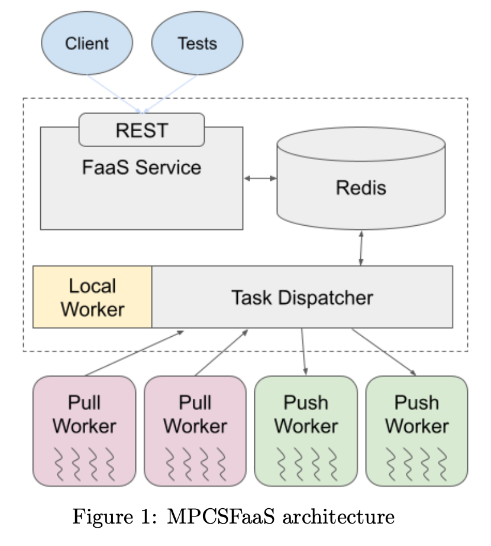

# Function as a Service (FaaS) Final Project
By Vaidas Razgaitis and Adam King

## Overview
MPCSFaaS is a Function-as-a-Service (FaaS) platform enabling users to execute Python functions in a serverless environment. It provides a RESTful API, a task dispatcher, and worker pools integrated with a Redis database. The system operates in three modes: `[local/pull/push]`, each using different task dispatching algorithms. 

The main components of MPCSFaaS are:
- **FastAPI-based RESTful API**: For managing function registration, execution, and status tracking
- **Redis Database**: For storing registered functions, tasks, and states
- **Task Dispatcher**: Orchestrates task distribution and manages worker states
- **Workers**: Execute tasks and return results
- **Message Channels**: Facilitate task communication between components


<div align="center">
  
</div>

## Architecture
### 1. RESTful FastAPI
The RESTful API is hosted using [FastAPI](https://fastapi.tiangolo.com/). FastAPI is a modern, fast web framework for building APIs with Python, taking advantage of type hinting. FastAPI provides excellent editor support and hosts production-ready code with interactive documentation.

The API handles:
- **Function Registration**: Accepts `dill` serialized functions, stores them in Redis, and assigns UUIDs
- **Task Execution**: Retrieves functions and parameters, queues tasks in Redis, and publishes task UUIDs on the `TASKS_CHANNEL`
- **Status and Results Reporting**: Exposes endpoints to retrieve task statuses and results


### 2. Redis Database
Redis serves two primary purposes:
1. **Key-Value Storage**: Stores registered functions, tasks, and task metadata as hashes for efficient retrieval
2. **Pub-Sub Messaging**: Broadcasts new task UUIDs to the `TASKS_CHANNEL` for dispatchers

Client-logged functions and tasks are logged in Redis as hashes, rather than JSON objects. 
Redis Hashes are more compact than serialized JSON, and can be rapidly retrieved. 

Redis serves as the single source of truth for tracking task state, avoiding consensus issues.

---

### 3. Task Dispatcher Architecture
The task dispatcher operates in three configurable modes: ```[local/pull/push]```. In conceptualizing these modes, we focused on identifying the instigator of events that triggers responsive behaviors by the task dispatcher.<br><br>
<div>
  
</div>

### Local Mode
This dispatcher follows a simple event-triggered architecture, where the task dispatcher listens over the PUB-SUB Redis channel for newly logged tasks and dispatches them immediately. The __client__ plays the instigating role by logging a task at the API, which triggers a braodcasted message over the Redis `TASKS_CHANNEL`
- Tasks are executed within the dispatcher using Python’s `multiprocessing` pool
- Ideal for development and testing


---

<div>
  
</div>

### Push Mode
For the push task dispatcher, we designed a hybrid event-event driven / polling architecture to efficiently reduce the task queue. The __dispatcher__ behaves as the instigator in this architecture, opperating under a principle of "my workers should always be busy, and I'll fetch them new
tasks as needed to enforce this worker state" 

- The dispatcher uses a **DEALER/ROUTER** ZMQ pattern to push tasks to workers
- The dispatcher aggressively assigns tasks based on worker availability and Redis task queue states

**Fault Tolerance and Worker Monitoring**:
  - Heartbeat messages ensure worker health
  - Tasks from failed workers are reassigned to Redis

--- 

<div>
  
</div>

### Pull Mode
For pull mode, we designed an event-driven architecture, where "hungry" workers aggressively pursue tasks by bombarding the task dispatcher with new work requests. The instigator is the __hungry worker__ coming online; doing so sends a message to the dispatcher that the worker is ready for tasks. After completing its first task, the hungry worker repeatedly requests the dispatcher to fetch Redis tasks on its behalf.

- Workers request tasks using **REQ/REP** ZMQ sockets
- Dispatcher acts as a broker, responding to worker requests with available tasks

**Fault Tolerance and Worker Monitoring**:
  - Configurable task deadlines track and reassign failed tasks.
  - Timeout mechanisms improve reliability and protect against obnoxious or costly function payloads 

--- 


## 4. Testing Framework
We used [coverage](https://coverage.readthedocs.io/en/7.6.8/) to expand on the pytesting framework. `Coverage` measures how much of your code is executed during tests, at a line-by-line level. These insights indicate effectiveness and level of coverage of the testing suite. Given more time, I would sniff around in the tool's codebase to see how to remove the test cases from reported "test coverage", as this 100% hit rate is not insightful. 

Test cases were written to test API routes, return values, error status codes, and specific errors and `user journeys` that can be inspected by looking at function names of test functions in `tests/test_webservice.py`. 

### TESTING SUMMARY
```
Name                       Stmts   Miss  Cover   Missing
--------------------------------------------------------
app/__init__.py                0      0   100%
app/main.py                   90     38    58%   61-63, 101-103, 131-161, 183-206, 231-255
app/utils.py                  29     21    28%   19, 60-65, 90-106
tests/__init__.py              0      0   100%
tests/serialize.py             6      0   100%
tests/test_API_routes.py      13      0   100%
tests/test_webservice.py      99      3    97%   12, 105, 171
--------------------------------------------------------
TOTAL                        237     62    74%
```

A comprehensive testing report can be seen by opening `htmlcov/index.html` in a browser. The test evaluator can click through each tested file in the codebase to understand the scope covered in testing. A preview is provided below-

<div>
  
</div>

### Coverage testing package instructions:
* Run pytest with coverage scanning enabled with ```coverage run -m pytest``` 
* Afterwards, run ```coverage report -m``` to get a console print of test coverage, or
* run ```coverage html``` to get a hyperlink to a full-blown tests report
* Subsequent runs of the project after having generated the coverage report can sometimes cause bugs involving ModuleNotFoundError importing 'tests'. 
run ```rm -rf htmlcov/*``` to purge tracer files and remove this error

## 5. Performance Evaluation
A performance evaluation client was implemented to compare the modes:
- **Metrics**: Latency and throughput were measured to assess efficiency and responsiveness
- **Experiments**: Weak scaling tests, increasing task volume proportionally with worker counts.
- **Observations**: Local mode achieved the best throughput and lowest latency due to minimal task dispatch overhead. Pull mode showed the worst latency and thoughput, due to the pestering bombardment of task requests from the pull workers to the dispatcher
- **For more detail**: Please see `technical_report.md`, `app/scaling_study.py`

## Setup and run (Linux/macOS only)
__Note to grader__: 
Our python files run as packages, which was a necessary trade-off to get the `coverage` tool to work for auto-generating test reports. This means that each python component needs to be ran with `python3 -m app.<python_name>`, rather than the requested `python3 <script.py>` instructions (Ie __add__ flag `-m` and __do not__ include `.py` ending). Additionally, we opted to use a `-mode` flag in place of the requested `-m` when launching the task dispatcher to avoid confusion. Sorry for the inconvenience.

__Launch project__: 

(all commands from root project dir unless `cd` specified)
* run ```./setup_FaaS_venv``` to setup a virtual environment, activate it, and install packages
* run ```fastapi dev app/main.py``` to deploy the MPCSFaaS API server
* launch the task dispatcher with ```python3 -m app.task_dispatcher -mode [local/pull/push] -p <port> -w <num_worker_processors>```
* split terminals, ```cd app``` and launch a Redis server as a background job with ```redis-server &```. It can later be shutdown with ```redis-cli shutdown```
* If you specified pull or push worker modes, bring new workers online with ```python3 -m app.[pull_worker/push_worker] <num_worker_processors> <dispatcher url>``` 
- start push worker command example = `python3 -m app.push_worker 2 tcp://localhost:5555`
- start pull worker command example = `python3 -m app.pull_worker 2 tcp://localhost:5555`


<details>
<summary>Click to expand references</summary>
  
# References
* FastAPI - https://fastapi.tiangolo.com/tutorial/
* Pydantic for payload typechecking - https://fastapi.tiangolo.com/tutorial/path-params/#pydantic
* Redis - https://redis.io/docs/latest/develop/get-started/data-store/
* ZMQ - https://learning-0mq-with-pyzmq.readthedocs.io/en/latest/pyzmq/patterns/pubsub.html
* Push-Pull architecture - https://medium.com/@sahilsaini51/a-deep-dive-into-push-based-services-2a85fb27da96
* Python Redis ZMQ PUB-SUB example project - https://github.com/suyash248/persistent-zeromq/tree/master
* Redis PUB-SUB - https://www.geeksforgeeks.org/redis-publish-subscribe/
* Python multiprocessing - https://geeksforgeeks.org/multiprocessing-python-set-1/
* Python multiprocessing (PyDocs) - https://docs.python.org/3/library/multiprocessing.html
</details>

